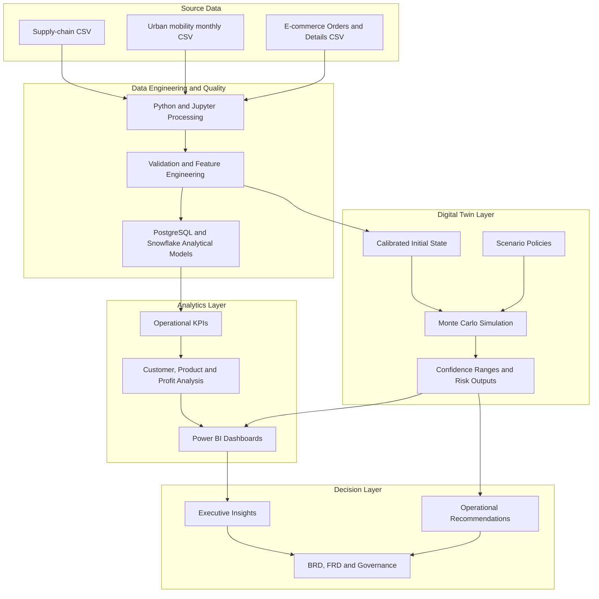

Data Analytics & Digital Twin Portfolio

Three end-to-end case studies combining data engineering, SQL, Python, Power BI, business analytics, and Monte Carlo digital-twin simulation.

Table of Contents

- About This Portfolio
- Featured Projects
  - Supply Chain Intelligence
  - Urban Mobility Intelligence
  - E-Commerce Analytics
- Portfolio Architecture
- Technology Stack
- Skills Demonstrated
- Important Modeling Note
- Contact

About This Portfolio

This repository presents three complete analytics case studies covering supply-chain operations, urban mobility, and e-commerce. Each project progresses from data ingestion and quality validation to analytical modeling, interactive Power BI reporting, scenario simulation, actionable recommendations, and controlled BRD/FRD documentation.

The digital twins extend traditional dashboards from **“What happened?”** to **“What could happen if operating policies change?”** Results are generated through transparent Monte Carlo simulations with documented assumptions and confidence ranges.

Featured Projects

 1. Supply Chain Intelligence & Digital Twin

Simulates how inventory, supplier, logistics, quality, and demand policies affect service, stockouts, profit, and working inventory.

Area | Details 
 Data | 100-SKU supply-chain dataset 
 Analytics | KPIs, EDA, profitability, product segmentation, supplier and logistics scores 
 Digital twin | Daily demand, inventory, replenishment pipeline, defects, fulfillment, revenue, and cost 
 Scenarios | Baseline, Lean, Recommended, Resilience 
 Tools | Python, pandas, NumPy, scikit-learn, Jupyter, Power BI 

Selected results

- Recommended policy improved modeled service level from 67.8% to 78.7%.
- Modeled lost demand decreased by approximately 14,178 units.
- Modeled 90-day profit increased by approximately 183,170, subject to prototype cost assumptions.

 2. Urban Mobility Intelligence & Digital Twin

Tests how fleet availability, driver supply, trip duration, productivity, shared mobility, sustainability, and disruption affect urban transport service.

 Area | Details 

Data | 896 monthly records, January 2010–May 2026 
Coverage | Six mobility license classes 
Data engineering | Python ingestion, cleaning, validation, and processed datasets 
Warehouse | Snowflake tables and analytical KPI views 
Digital twin | Demand, vehicles, drivers, trip time, capacity, served/unmet trips, sharing, and emissions proxy 
Tools | Python, pandas, NumPy, Snowflake SQL, Power BI 

Selected results

- Transit Priority improved modeled service from 95.1% to 99.9%.
- Modeled unmet trips decreased from approximately 46,319 to 1,092 per day.
- Weighted trip duration decreased from approximately 20.0 to 18.4 minutes.
- Sustainability reduced the operational emissions proxy by approximately 24%.
- 
 3. E-Commerce Analytics & Digital Twin

Evaluates pricing, growth, inventory, replenishment, returns, fulfillment, revenue, and profitability strategies for Madhav E-Commerce.

 Area | Details 

Data | 500 orders and 1,500 order-detail records 
Historical KPIs | ₹437,771 sales, ₹36,963 profit, 5,615 units 
ETL | PostgreSQL staging, auditing, cleaning, constraints, indexes, and views 
Digital twin | Demand, virtual inventory, replenishment, fulfillment, returns, pricing, cost, and profit 
Scenarios | Baseline, Growth, Margin Guard, Inventory Optimized, Stress 
Tools | PostgreSQL, Python, pandas, NumPy, Power BI 

Selected results

- Margin Guard increased modeled profit from approximately ₹12,951 to ₹26,849.
- Inventory Optimized improved modeled fill rate from 92.6% to 95.5%.
- Modeled lost units decreased by approximately 37%.
- Blanket discount-led Growth increased revenue but produced an estimated ₹10,009 loss.

## Portfolio Architecture

 Technology Stack

 Technology | Portfolio use 

Python | Data processing, validation, scenario engines, and automation 
pandas / NumPy | Tabular analysis, stochastic simulation, and output generation 
PostgreSQL | E-commerce staging, cleaning, constraints, analytical views, and indexing 
Snowflake SQL | Urban-mobility warehouse tables and Power BI serving views 
Jupyter Notebook | Supply-chain exploration, feature engineering, ML, and narrative analysis 
scikit-learn | Experimental segmentation and predictive models 
Power BI | Executive dashboards, KPI monitoring, scenario comparison, and drill-through 
DOCX documentation | Business report, BRD, FRD, requirements, controls, and acceptance criteria 

 Skills Demonstrated

- End-to-end data analytics and data-engineering workflow design
- Data cleaning, quality validation, schema design, and referential integrity
- PostgreSQL and Snowflake analytical SQL
- KPI definition, profitability analysis, segmentation, and exception reporting
- Python Monte Carlo simulation and digital-twin state modeling
- Scenario design, sensitivity analysis, uncertainty ranges, and risk interpretation
- Power BI data modeling, dashboard design, slicers, trends, and drill-through
- Business requirements, functional requirements, acceptance tests, and governance
- Translation of analytical findings into operational recommendations

Important Modeling Note

The digital-twin results in this portfolio are **scenario estimates**, not guaranteed forecasts. Where operational fields were unavailable, assumptions were explicitly defined and documented. Production implementation would require additional dated events, business constraints, financial reconciliation, back-testing, monitoring, and human approval workflows.

 Contact
Shil Gawande
- Phone No : 9172937014
- Email: gawandeshil9@gmail.com

---

If you find these projects useful, consider starring the repository.
